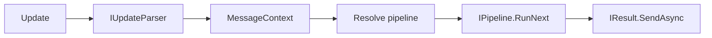

# Eclipse.Core

`Eclipse.Core` is the Telegram bot **pipeline runtime** for the Eclipse solution. It provides dependency-injection registration, update parsing, routing to `IPipeline` implementations, multi-stage execution, validation, result sending, and pipeline/message persistence abstractions.

This document describes **every public (and important internal) abstraction** in the assembly and how the host application typically configures **webhooks** and the **HTTP controller** that receives Telegram updates. Webhook URL construction and startup registration live outside the Core assembly (see [Webhook and controller integration](#webhook-and-controller-integration)); Core supplies the handlers and routing logic those endpoints invoke.

---

## Table of contents

1. [Conceptual flow](#conceptual-flow)
2. [Registration: `EclipseCoreModule` and `CoreBuilder`](#registration-eclipsecoremodule-and-corebuilder)
3. [`CoreOptions`](#coreoptions)
4. [Update handling: `IEclipseUpdateHandler`](#update-handling-ieclipseupdatehandler)
5. [Webhook and controller integration](#webhook-and-controller-integration)
6. [Pipelines](#pipelines)
7. [Routing and matching updates](#routing-and-matching-updates)
8. [Results (`IResult`)](#results-iresult)
9. [Stores](#stores)
10. [Update parsing](#update-parsing)
11. [Other abstractions](#other-abstractions)
12. [Reference: services registered by `AddCoreModule`](#reference-services-registered-by-addcoremodule)

---

## Conceptual flow

When an update is received (typically via webhook POST to the ASP.NET Core app), the active `IEclipseUpdateHandler` implementation:

1. Optionally filters by `CoreOptions.AllowedUpdateTypes`.
2. Parses the Telegram `Update` into a `MessageContext` via `IUpdateParser` / `IParseStrategy` implementations.
3. Sets the current update on `IUpdateAccessor` for downstream code.
4. Resolves the pipeline: callback message store → pipeline store by chat → else `IPipelineProvider.Get(update)`.
5. Runs optional `IPipelinePreConfigurator` hooks, then `IPipeline.RunNext` (wrapped by `IPipelineExecutionDecorator` middleware).
6. Sends the returned `IResult` through the bot client and updates `IMessageStore` / `IPipelineStore` as needed.



---

## Registration: `EclipseCoreModule` and `CoreBuilder`

### `AddCoreModule`

Extension method: `IServiceCollection AddCoreModule(this IServiceCollection services, Action<CoreBuilder>? builder = null)`.

**Requirements:**

- **Both** `IPipelineStore` and `IMessageStore` must be registered **before** or **inside** the `CoreBuilder` callback. If neither is registered, `AddCoreModule` throws: *"Stores are not configured. Call CoreBuilder.UseInMemoryStores(); if no other provider is registered."*
- If `IOptions<CoreOptions>` is not configured, `AddCoreModule` applies a default `Configure<CoreOptions>` with message persistence days only (see [`CoreOptions`](#coreoptions)).

### `CoreBuilder`

Fluent configuration returned by the `AddCoreModule` callback:

| Method | Purpose |
|--------|---------|
| `Decorate<TPipelineExecutionDecorator>()` | Registers **one or more** `IPipelineExecutionDecorator` (transient). They wrap `RunNext` in an onion/middleware pattern. |
| `UseKeywordMapper<TKeywordMapper>(lifetime)` | Registers `IKeywordMapper` (default: `TryAdd` singleton behavior via `TryAdd` in module for `NullKeywordMapper` if none supplied). |
| `UsePipelineStore<TPipelineStore>()` | Scoped `IPipelineStore`. |
| `UseMessageStore<TMessageStore>()` | Scoped `IMessageStore`. |
| `ConfigureOptions(Action<CoreOptions>)` | Binds or configures `CoreOptions`. |
| `AddPreConfigurator<TPipelinePreConfigurator>()` | Transient `IPipelinePreConfigurator` invoked before each pipeline run. |

**Built-in store helper (Core):** `InMemoryStoresConfiguration.UseInMemoryStores(this CoreBuilder)` registers `InMemoryPipelineStore` and `InMemoryMessageStore` (for tests or non-production scenarios).

The production host in this repo uses **`Eclipse.Pipelines.Stores.CacheStoresConfiguration.UseCacheStores()`** (Redis-backed implementations), not the in-memory types.

---

## `CoreOptions`

Bound from configuration section `CoreOptions` in `appsettings.json`:

| Property | Meaning |
|----------|---------|
| `MessagePersistanceInDays` | How long bot messages are retained for cleanup in `IMessageStore.RemoveOlderThan` (default **3** if not configured). |
| `AllowedUpdateTypes` | List of `Telegram.Bot.Types.Enums.UpdateType` values. If the incoming update’s type is **not** in this list, `EclipseUpdateHandler` logs a warning and **returns without processing**. |

Example (from the solution):

```json
"CoreOptions": {
  "MessagePersistanceInDays": 3,
  "AllowedUpdateTypes": [
    "Message",
    "CallbackQuery",
    "MyChatMember"
  ]
}
```

---

## Update handling: `IEclipseUpdateHandler`

### Interface

```csharp
public interface IEclipseUpdateHandler
{
    HandlerType Type { get; }
    Task HandleUpdateAsync(ITelegramBotClient botClient, Update update, CancellationToken cancellationToken = default);
}
```

### `HandlerType`

- **`Active`** — Full pipeline execution (`EclipseUpdateHandler` in Core).
- **`Disabled`** — Minimal handling (`DisabledUpdateHandler`): parses the update and sends a fixed maintenance message.

`AddCoreModule` registers **both** implementations as `IEclipseUpdateHandler`. The host controller (see below) selects the handler by `HandlerType`.

### `EclipseUpdateHandler` (internal)

- Enforces `AllowedUpdateTypes`.
- Uses `IUpdateParser` → `MessageContext`.
- Resolves pipeline (callback inline storage → pipeline by chat → `IPipelineProvider`).
- Applies `IPipelinePreConfigurator` for each resolved pipeline.
- Supports `RedirectResult`: re-dispatches as a synthetic `Message` update using the `RouteAttribute.Command` of the target pipeline type.
- Persists pipeline state via `IPipelineStore` and messages via `IMessageStore`.

### `DisabledUpdateHandler`

Does not run pipelines; sends a single static message to the user when the bot is in maintenance mode.

---

## Webhook and controller integration

Core does **not** contain ASP.NET types. In this solution, **webhook URL management** and **HTTP endpoints** are implemented in `Eclipse.WebAPI` and `Eclipse.Pipelines`. The following is how they connect to Core.

### 1. Public URL and webhook path

The application exposes a **public HTTPS base URL** (e.g. `App:SelfUrl` via `IAppUrlProvider`). The **webhook URL** is:

`{AppUrl}/{ActiveEndpoint}`

Example:

- `App:SelfUrl`: `https://localhost:7236`
- `Telegram:ActiveEndpoint`: `api/eclipse/_handle`
- Webhook: `https://localhost:7236/api/eclipse/_handle`

### 2. Startup: `InitializePipelineModuleAsync`

`Eclipse.Pipelines.EclipsePipelinesModule.InitializePipelineModuleAsync` runs after the web app is built. It:

1. Reads `IOptions<PipelinesOptions>` (bound from the `Telegram` configuration section).
2. Compares Telegram’s current webhook info with `{AppUrl}/{ActiveEndpoint}`.
3. If different, calls `SetWebhook` with `secretToken: options.Value.SecretToken`.

So the **webhook path** must stay in sync with:

- The **route** of the controller action that receives updates (see below).
- **`Telegram:ActiveEndpoint`** in configuration (and `PipelinesOptions.ActiveEndpoint` when using the pipelines module).

### 3. Configuration keys (`appsettings`)

Typical `Telegram` section:

```json
"Telegram": {
  "Token": "<your-bot-token>",
  "Chat": "<chat-id>",
  "SecretToken": "<secret-token>",
  "ActiveEndpoint": "api/eclipse/_handle",
  "DisabledEndpoint": "api/eclipse/_disabled"
}
```

- **`Token`**, **`SecretToken`**, **`ActiveEndpoint`**: used by pipeline initialization and `PipelinesOptions` (see `Eclipse.Pipelines`).
- **`DisabledEndpoint`**: used by the admin API to point the webhook at the maintenance route (not a property on `PipelinesOptions`; extra JSON keys are ignored by the binder for that type).

### 4. HTTP controller: `EclipseController` (host)

Located in `Eclipse.WebAPI/Controllers/EclipseController.cs`:

| Route | Handler | Purpose |
|-------|---------|---------|
| `POST api/eclipse/_handle` | `HandlerType.Active` | Normal bot processing via `EclipseUpdateHandler`. |
| `POST api/eclipse/_disabled` | `HandlerType.Disabled` | Maintenance mode via `DisabledUpdateHandler`. |

The controller:

- Injects `IEnumerable<IEclipseUpdateHandler>` and builds a dictionary keyed by `HandlerType`.
- For each request, calls `HandleUpdateAsync` on the selected handler.

**Security:** the class uses `[TelegramBotApiSecretTokenAuthorize]`, which validates the HTTP header **`X-Telegram-Bot-Api-Secret-Token`** against `IConfiguration["Telegram:SecretToken"]`. This must match the `secret_token` passed to `SetWebhook` so only Telegram can call the endpoint.

### 5. Switching webhook at runtime: `TelegramController`

Admin-only endpoint `POST api/telegram/switch-handler`:

- Reads `Telegram:{HandlerType}Endpoint` from configuration (e.g. `Telegram:ActiveEndpoint`, `Telegram:DisabledEndpoint`).
- Builds full URL: `{AppUrl}/{endpoint}`.
- Calls `ITelegramService.SetWebhookUrlAsync` (application layer), which validates HTTPS and sets the webhook on the bot.

This allows switching between **active** and **disabled** handler URLs without redeploying.

### 6. End-to-end checklist

1. **HTTPS** — Telegram requires HTTPS for webhooks (except local testing with tunnels).
2. **Same secret** — `Telegram:SecretToken` in config = secret passed to `SetWebhook` = header validation in `TelegramBotApiSecretTokenAuthorize`.
3. **Path alignment** — `ActiveEndpoint` matches the MVC route (`api/eclipse/_handle`).
4. **Allowed updates** — `CoreOptions.AllowedUpdateTypes` includes every `UpdateType` you need; otherwise Core drops the update.
5. **Optional:** Register `PurchasedPaidMediaHandler` if you handle `UpdateType.PurchasedPaidMedia` — the class exists in Core but is **not** registered by `AddCoreModule` (see [Routing](#routing-and-matching-updates)).

---

## Pipelines

### `IPipeline`

- `StagesLeft`, `IsFinished`, `SetUpdate`, `RunNext`, `SkipStage`.

### `Pipeline` (abstract base)

Holds the current `Update` and provides **static helpers** for building `IResult`: `Empty`, `Text`, `Edit`, `Menu`, `Redirect<TPipeline>`, `Photo`, `Multiple`, `RemoveInlineMenuAndSend`, etc.

### `PipelineBase`

- Implements `RunNext` by dequeuing `IStage` instances.
- Wraps execution with **all** registered `IPipelineExecutionDecorator` services (from `MessageContext.Services`), similar to middleware.
- Subclasses implement `Initialize()` and call `RegisterStage(...)`.

### `INotFoundPipeline` / `NotFoundPipeline`

When no route matches, `PipelineProvider` falls back to `INotFoundPipeline` (default empty pipeline). The application can **replace** the registration (e.g. `EclipsePipelinesModule` replaces with `EclipseNotFoundPipeline`).

### `IAccessDeniedPipeline` / `AccessDeniedPipeline`

When `ContextValidationAttribute` validation fails on a pipeline type, `PipelineProvider` returns `IAccessDeniedPipeline` with validation results set via `SetResults`.

---

## Routing and matching updates

### `IPipelineProvider`

- `IPipeline Get(Update update)` — selects `IRouteHandler` by `update.Type`, gets an `IPipeline`, then runs context validation.

### `IRouteHandler` (internal)

Handlers registered by `AddCoreModule`:

| Handler | `UpdateType` | Selection logic |
|---------|--------------|-----------------|
| `MessageHandler` | `Message` | Uses `IKeywordMapper.Map` on message text; matches `[RouteAttribute]` by **command** (starts with `/`) or **route** string. |
| `MyChatMemberHandler` | `MyChatMember` | First pipeline whose `[MyChatMemberPipelineAttribute]` returns true from `CanHandle`. |
| `UnknownHandler` | `Unknown` | Always returns null → not-found pipeline. |

`PurchasedPaidMediaHandler` exists in Core but is **not** registered in `EclipseCoreModule`. To use it, add `AddScoped<IRouteHandler, PurchasedPaidMediaHandler>()` (and ensure `AllowedUpdateTypes` includes `PurchasedPaidMedia`).

If no handler exists for an update type, `PipelineProvider` uses `UnknownHandler`.

### Attributes

- **`[RouteAttribute(string route, string? command = null)]`** — On pipeline classes. `MessageHandler` matches commands vs. routes as described above.
- **`MyChatMemberPipelineAttribute`** — Abstract; subclass and implement `CanHandle(ChatMemberUpdated)` for precise matching.
- **`PurchasedPaidMediaPipelineAttribute`** — Marks a single pipeline for `PurchasedPaidMedia` updates (requires handler registration).

---

## Results (`IResult`)

- **`IResult`** — `SendAsync(ITelegramBotClient, CancellationToken)` returns the sent `Message` if any.
- Concrete types include `TextResult`, `EmptyResult`, `MenuResult`, `EditTextResult`, `EditMenuResult`, `PhotoResult`, `RedirectResult`, `MultipleActionsResult`, etc.

`EclipseUpdateHandler` uses the returned `Message` to update pipeline/message stores when appropriate.

---

## Stores

### `IPipelineStore`

Persists **active pipeline instances** per chat (and optionally per inline message id for callback queries). Used to implement multi-step conversations.

### `IMessageStore`

Tracks **bot messages** per chat pipeline type for features that need “latest bot message”; supports pruning via `RemoveOlderThan`.

Both are **scoped** and must be provided by the application (in-memory, Redis cache, etc.).

---

## Update parsing

### `IUpdateParser` / `UpdateParser`

Delegates to `IParseStrategyProvider` by `update.Type`.

### `IParseStrategy`

One implementation per supported `UpdateType` (e.g. message, callback query, my chat member). Returns `MessageContext` or null.

### `MessageContext`

`ChatId`, `Value` (parsed payload string), `TelegramUser`, and **`Services`** (`IServiceProvider`) — used by stages and decorators to resolve scoped services.

---

## Other abstractions

### `IUpdateAccessor`

Holds the current `Update` for the request scope (`Set` called by `EclipseUpdateHandler`).

### `IKeywordMapper`

Maps raw message text to a **route keyword** before `RouteAttribute` matching (e.g. localization). Default `NullKeywordMapper` passes through unchanged.

### `IPipelinePreConfigurator`

`Configure(Update update, IPipeline pipeline)` — run after pipeline resolution, before `RunNext` (culture, user tracking, etc.).

### `IPipelineExecutionDecorator`

Middleware around `RunNext`; multiple decorators nest in registration order.

### `ContextValidationAttribute`

Abstract attribute; implement `Validate(ValidationContext)` returning `ValidationResult`. Applied to **pipeline types**; failure routes to `IAccessDeniedPipeline`.

### `ValidationContext`

Contains `IServiceProvider` and `Update` for validation.

---

## Reference: services registered by `AddCoreModule`

| Service | Lifetime | Notes |
|---------|----------|--------|
| `IPipelineProvider` | Scoped | `PipelineProvider` |
| `IPipelineExecutionDecorator` | Scoped | `NullPipelineExecutionDecorator` + any `Decorate<T>()` |
| `IUpdateAccessor` | Scoped | `UpdateAccessor` |
| `IEclipseUpdateHandler` | Transient | `EclipseUpdateHandler`, `DisabledUpdateHandler` |
| `IUpdateParser` | Transient | `UpdateParser` |
| `IParseStrategyProvider` | Transient | |
| `IParseStrategy` | Transient | Callback, Message, Unknown, MyChatMember strategies |
| `IRouteHandler` | Scoped | Message, MyChatMember, Unknown |
| `IKeywordMapper` | Singleton (default) | `NullKeywordMapper` if not replaced |
| `INotFoundPipeline` | Singleton | `NotFoundPipeline` if not replaced |
| `IAccessDeniedPipeline` | Scoped | `AccessDeniedPipeline` if not replaced |
| `IPipelinePreConfigurator` | Transient | All `AddPreConfigurator<T>()` |

---

## Related projects

| Project | Role |
|---------|------|
| `Eclipse.Pipelines` | Concrete `IPipeline` types, `PipelinesOptions`, `AddPipelinesModule`, webhook init, Telegram HTTP client. |
| `Eclipse.WebAPI` | `EclipseController`, `TelegramController`, secret-token filter. |
| `Eclipse.Application` | `TelegramService` for sending messages and setting webhook URL from admin API. |

For local development, ensure the public URL in `App:SelfUrl` matches what Telegram can reach (often via ngrok or similar) and that webhook initialization runs after the app URL is correct.
